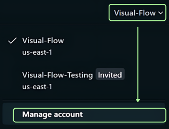
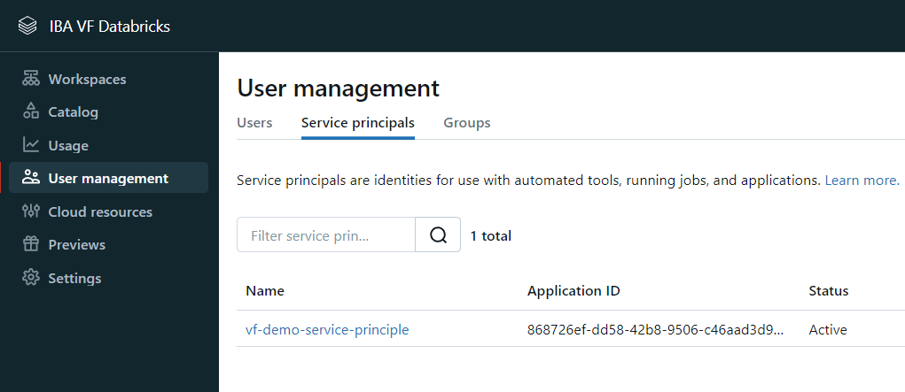
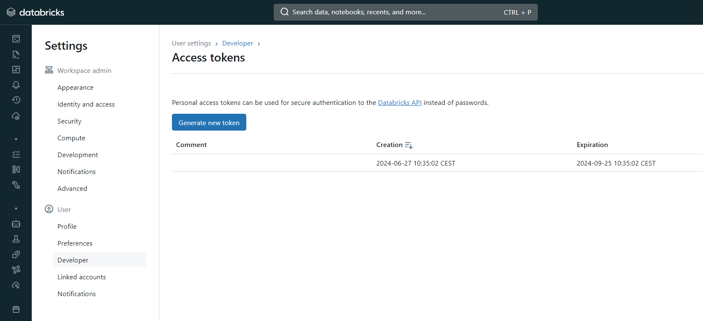
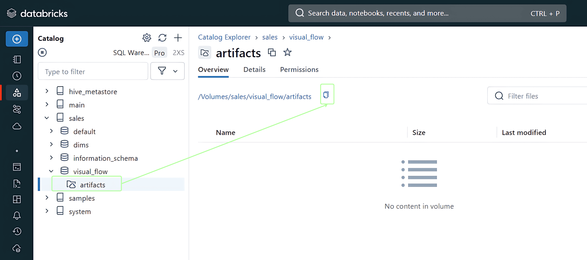

## Step 1
Log in to your Databricks account.

## Step 2
Ensure your Databricks workspace is configured and running as per your requirements.
Get Databricks workspace URL.

Click your workspace name → Manage account

Click your email address → Workspaces → select URL

## Step 3
Select Authentication type: OAuth or Personal Access Token

### For [OAuth] option:

Generate OAuth secret

Click workspace name → Manage account

User management → Service principals → Click your service principal or create a new one

Click Generate secret

### For [Personal Access Token] option:

Generate a Personal access token if you haven’t done already.

Click your user name → Settings

Developer → Generate new token button

## Step 4
Ensure you have a volume (whatever volume path you like) where Visual Flow will put prerequisite files. For example:

Click path in your volume → copy button

## Step 5
Click the “+” button to create a new project. In the Create Project window specify: Project Name, Description, Databricks workspace URL, Authentication type (OAuth or Personal access token), Volume path, and click the “Save” button.

“+” select

**[OAuth]**

**[Personal Access Token]**

