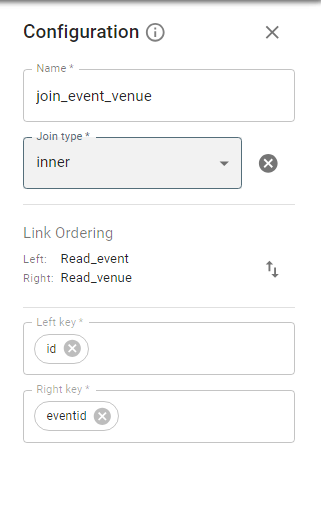

# Join Stage.

Available types of join are:

* *Inner join*. Transfers records from input data sets whose key columns contain equal values to
the output data set. Records whose key columns do not contain equal values are dropped.
* *Left outer* join. Transfers all values from the left data set but transfers them from the right one only when
key columns match. The stage drops the key column from the right data set.
* *Right outer* join. Transfers all values from the right and left data sets. Intermediate them only when key
columns match. The stage drops the key column from the left and intermediate data sets.
* *Full outer* join. Transfers records in which the contents of the key columns are equal from the left and
right input data sets to the output. It also transfers records whose key columns contain unequal values
from input and output data sets.
* *Cross join*. Returns a result data set where each row from the first table is combined with each
from the second table.

* Left semi join. Returns values from the left relation that has a match with the right.
* Left anti join. Returns values from the left relation that has NO match with the right.

*Link Ordering* option allows you to specify which input link is regarded as the left and which as the right. By default,
the first link added is left, and the last one is right.
With *Left Key* and *Right Key* you must enter the key of joining.

