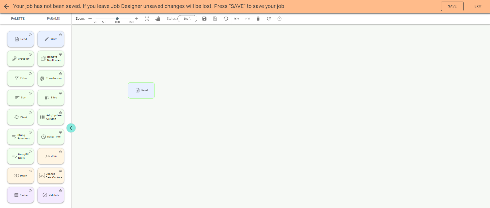
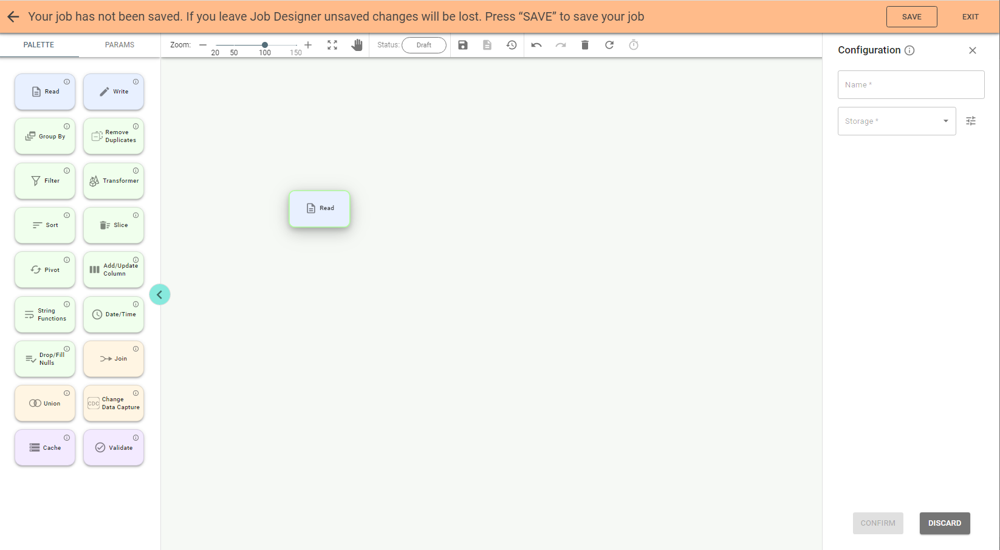
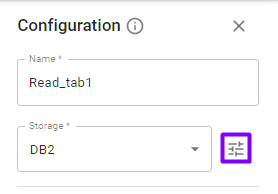
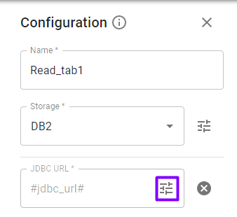
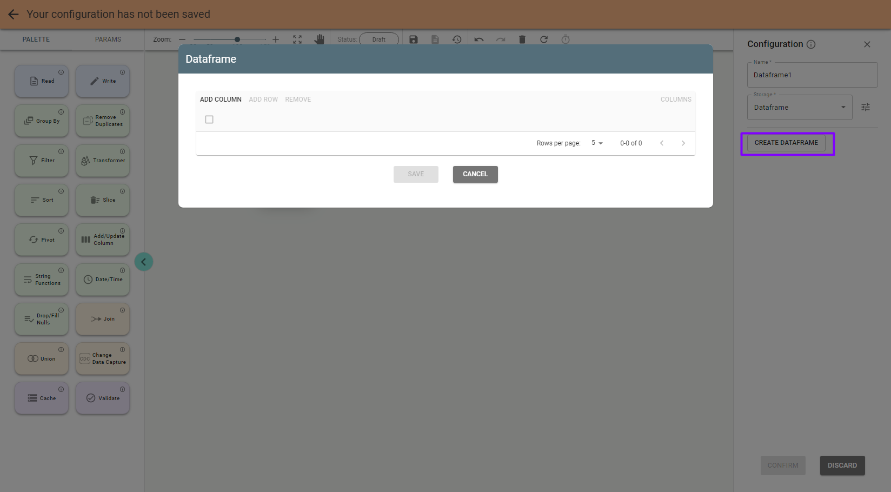

# Read Stage.

You can start creating a job by dragging a stage to the canvas, e.g., you can drag the **Read** stage:

**Note**: you can also add a stage by double clicking its tile on the palette.
*Double-click* on a stage on canvas opens the configuration panel on the right:

Enter a name for the stage and select storage e.g. *DB2* if you want to read data from the DB2 table.

Available *Storage* values for Read stage are:

* API
* AWS S3
* Cassandra
* ClickHouse
* Dataframe
* DB2
* Elasticsearch
* IBM COS
* Local file
* Mongo
* MySQL
* MSSQL
* Oracle
* PostgreSQL
* Redis
* Redshift
* Redshift-jdbc

**Important**: you can select an existing connection with the *Parameters* button near the Storage field:

If you do so, its parameters, e.g., JDBC URL, user, etc., are filled automatically.
But now, suppose you don’t have a connection created previously, so fill required parameters for *DB2* storage
manually:

Important: you can pick up a parameter value with the *Parameters* 
button on the right panel if it is previously created as a project parameter.

The Read stage for DB2 storage has an option *Custom SQL* to read data with SQL statement (e.g., select
\* from table where field = value). If you select Custom SQL - True you need to enter the SQL statement and specify the
schema:

For the *Redis* source you need to define *Key column*, *Model*, *SSL*, *Read mode*, *Keys* pattern or Table fields in the Configuration of the *Read* stage.

* Key column. The Column name to store the hash key.
* Model (binary, hash) defines the Redis model used to persist dataframe. By default, it is hash.
* Read mode (key, pattern) defines how the read operation is handled. If Key is selected, then the read
is done based on the table field. In the case of *Pattern* the provided pattern (option *Keys Pattern*) dictates
what Redis key to read.
*Keys pattern*. If the pattern ends with * (e.g., “table: *”), all keys from it are read.
If one pattern is defined (e.g., “table: first value”), then only one key is read.

**Note**: with *Dataframe* storage option you can create your own dataset:

Save the stage by pushing the *Confirm* button on the configuration panel. Push the Save button above if you want
to save the job at this step.
When the first stage of the job is configured, the canvas looks like this:

