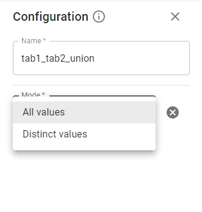

# Union Stage.

You can union two datasets.

**Note**: Columns sequence, names, and types are important for union operation.

Mode contains 2 options: *All* values and *Distinct* values.

* *Distinct* values, which is the default, eliminates duplicate records from the second dataset.
* *All* values needs to be specified explicitly, and it tolerates duplicates from the second dataset.

