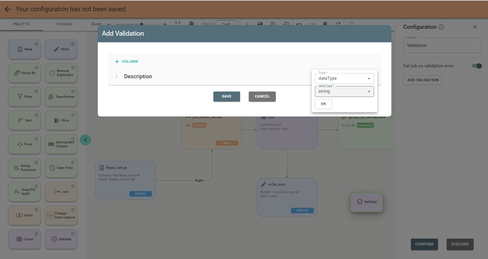

# Validate Stage

With the *Validate* stage you can run the data validation using Spark job validation types:

* dataType
* minValue
* maxValue
* minLength
* maxLength
* notNull
* inValues
* regex
* uniqueness

To add a validation you need to push Add Validation button on the stage configuration panel and start adding a column
validation:

When you hit **Ok** the validation row appears:

Once you are done with adding all validations push Save on the dialog screen and then confirm the stage configuration.
Save the job by pushing Save on Job Designer header.
For a newly created job, as long as it is not yet run, its status is Draft: 

Drag other stages according to the data flow from source to destination.
See the job with more stages as an example:

