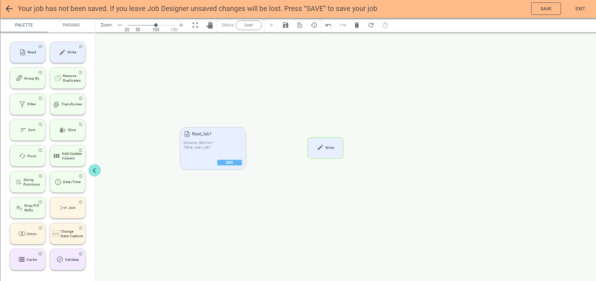
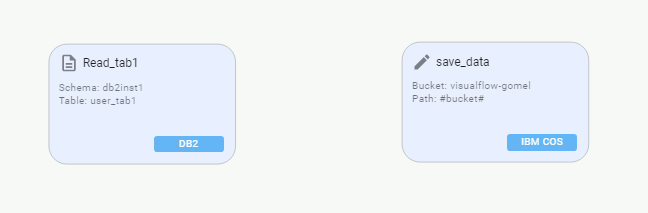
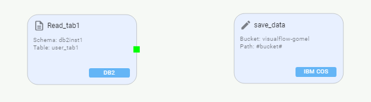
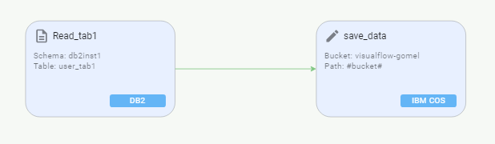

# Write Stage.

Now drag another stage, e.g., Write stage:

Enter a name for the stage and select storage IBM COS if you want to post data from the DB2 table to
the Cloud Object Storage file. Fill required parameters for the IBM COS storage.

Available storage values for the Write stage are:

* AWS S3
* Cassandra
* ClickHouse
* DB2
* Elasticsearch
* IBM COS
* Local file
* Mongo
* MSSQL
* MySQL
* Oracle
* PostgreSQL
* Redis
* Redshift
* Redshift-jdbc
* STDOUT

IBM COS storage has two options of Authentication type: *HMAC* and *IAM*.
If *HMAC* is selected, you should fill accessKey and secretKey.
If *IAM* is selected, iamApiKey and iamServiceId should be entered.

For the storages *IBM COS* and *AWS S3* the function *Partition By* can be used in the *Write* stage. It partitions the output
on the file system by given columns. If specified, the output is laid out on the file system similar to Hive's partitioning scheme.

As an example, when we partition a dataset by year and then month, the directory layout looks like this:
- year=2016/month=01/
- year=2016/month=02/
In the case of importing table data with *Write* stage to *Cassandra* source from another storage, the table layout for
output must be previously created in Cassandra. Columns, key fields, and data types of the fields must be specified in the table.

**Important**: All the above points must match the imported table.

If the column names have uppercase characters in the imported table when data is output to *Cassandra*, the job will
fail as column names are stored there in lowercase only. You can resolve this issue with the *Transformer* stage.
The output recorded to *STDOUT* storage can be seen in Logs. The number of records shown in the logs can be specified
in the *Quantity* field. The available range is from 1 to 2147483631 records.
For *Redis* source in Write stage, the following fields must be specified: *Key column, Model, SSL, TTL, Table* and *Write* mode.

* Key column. For writing. It specifies the unique column used as the Redis key. By default, the key is auto-generated.

* *TTL*. Data expiration time in seconds. Data doesn't expire if TTL is negative or 0. By default, it is 0. A
positive value of *TTL* means the number of seconds in which the data will be removed.

**Important**:
The *Write* mode field defines how data is posted to its destination. Available values are:

* Overwrite
* Append
* Error if Exists

With *Overwrite* Write mode Truncate mode can be used for DB2, Oracle, MySQL, PostgreSQL, MSSQL and Redshift:

* None. No truncation occurs, but the target table is deleted and recreated. Note that all the indexes, constraints
and other modifiers assigned for this table will be lost.
* Simple. The standard truncation that deletes data from the target table but keeps the indexes, constraints and
other modifiers intact. However, if the target table has a primary key referenced as a foreign key in other ta-
bles, the truncation will fail. To resolve this, either use Cascade mode or manually drop constraints (outside of
VF) prior to accessing the table with VF.
* Cascade (only for Oracle and PostgreSQL). The cascade truncation not only deletes the data from the target
table but also from other tables that use the target table's primary key as a foreign key constraint.

File format is to choose a format of the destination file. Available formats are:

* CSV
* JSON
* Parquet
* ORC
* Text
* Avro

Confirm the stage by pushing **Confirm** on the panel. Now there are two stages to connect.

**Important**: to connect stages, hover a mouse on a stage edge until you see a green rectangle. Click and drag it to
the border of another stage and its green rectangle. When you reach it, a green arrow should appear.

Other stages available are:

* Group By
* Remove Duplicates
* Filter
* Transformer
* Sort
* Slice
* Pivot
* Add/Update Column
* String Functions
* Date/Time
* Drop/Fill Nulls
* Join
* Union
* Change Data Capture
* Cache
* Validate
