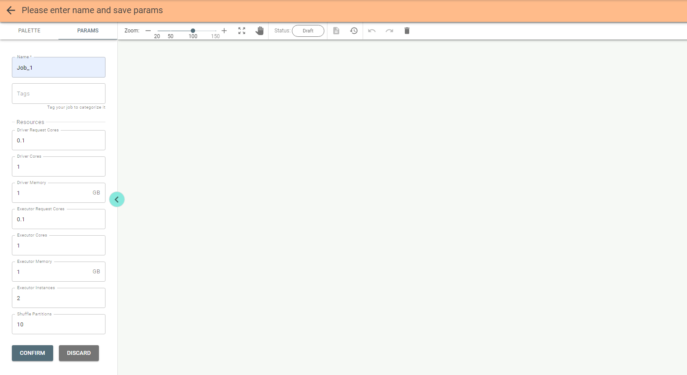
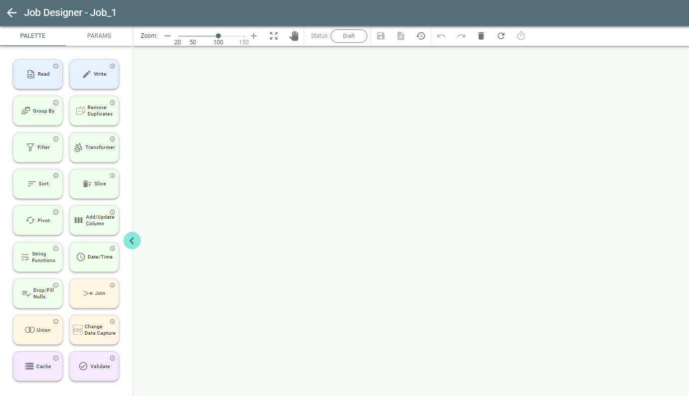

# Create a Job.

With the Add Job button pushed you get to Job Designer to create a new job.

You must provide a name for the job on the left configuration panel.
Tags can be used to classify your job.
Update parameters or keep their default values and then push the **Confirm** button:

Save the job by pushing the **Save** button on **Job Designer** header.
Now you see the **Palette** tab with all available stages:

