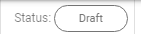

# Job Designer functions overview

The following functions are available in *Job Designer*:

* Zoom operations:
* Switch mode between
Move  and Select 
* Show job status 
* Run job  / Stop job  (for running)
* Save job 
* See job logs 
* See job history 
* Undo / Redo operation on canvas  
* Remove element from canvas 
* Refresh 
* Auto refresh 

**Note**: you can copy, edit or delete a stage on canvas using the mouse right-click menu options:

* Edit stage
* Copy stage
* Delete stage