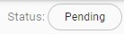
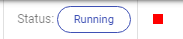
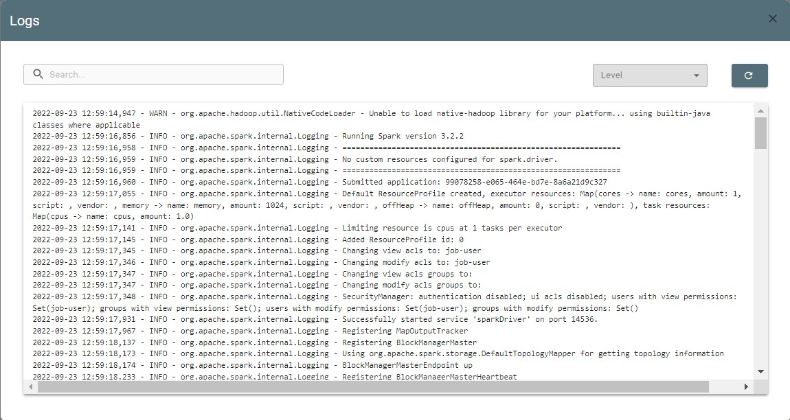
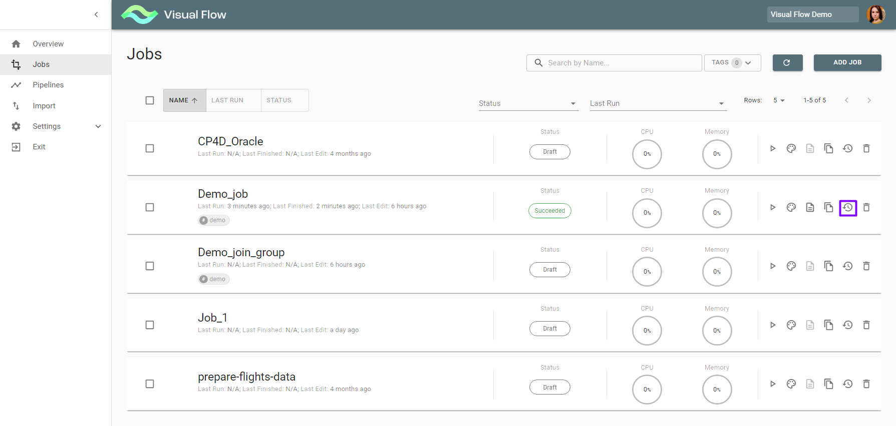
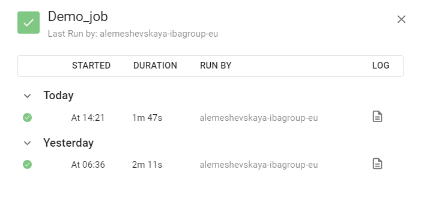

# Job Execution

Push the *Play* button  to run the job:

Its status changes from *Draft* to *Pending* 

Push Refresh to update the status. 
It should turn to *Running* 

While running, it can be interrupted with the *Stop* button. 
When a job is completed, its status is
*Succeeded* or *Failed*.
Use the Logs button  to analyze job logs. It gets you to Logs screen:

Logs can be filtered by level. Such as:

* INFO
* WARNING
* ERROR
* DEBUG
* RESULT

You can also view earlier job runs data with the *Job History* button:

It takes you to *Job History* screen, containing each job run data, including logs:

