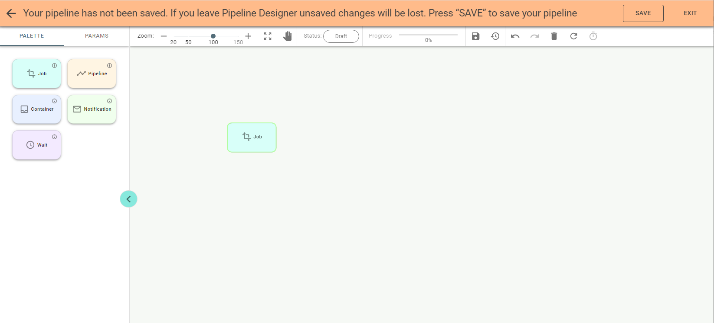
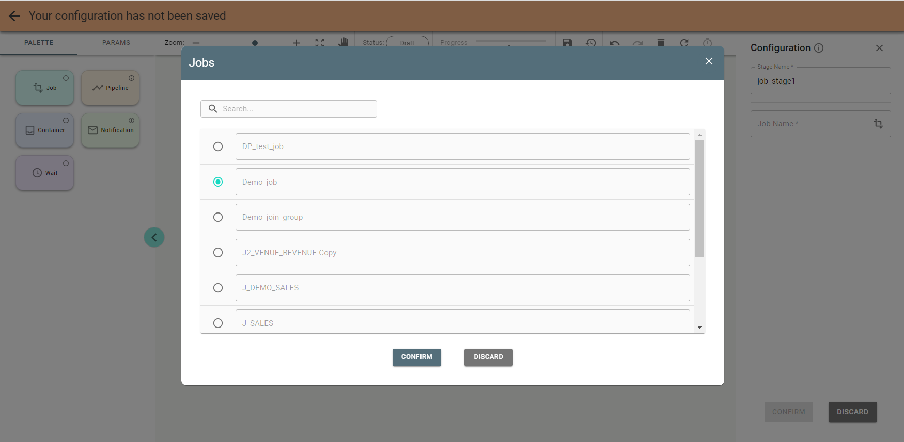
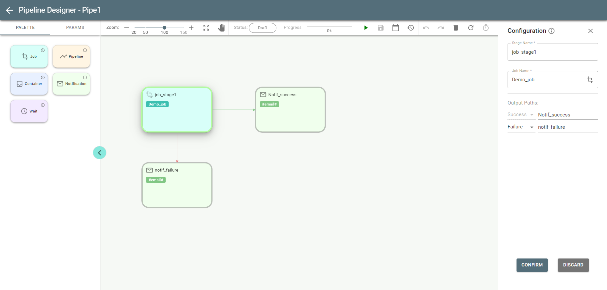
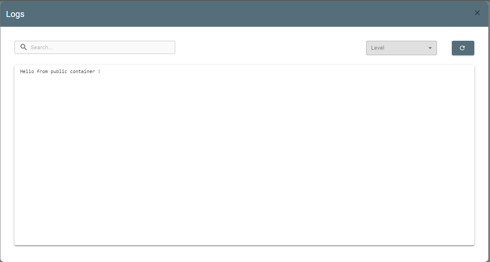

# Create a Pipeline

With the *Add Pipeline* button pushed, you get to *Pipeline Designer* for creating a pipeline.
On the left configuration panel the Params tab is open by default, where you can enter a pipeline name and tags for
the pipeline classification:

Once you add a name, notifications become available to you:

Set notifications to be notified on the pipeline events as you wish and push the *Confirm* button.

**Note**: you can set it specifically for Slack or email notifications.

Save the pipeline by pressing the *Save* button on *Pipeline Designer* header.
Once a pipeline is saved the Palette tab with all available stages is opened by default:

**Pipeline** is a combination of *Job, Pipeline, Notification, Container and Wait* stages.

The *Notification* stage is most often added to the configuration to notify about job/pipeline stage failure/success.

Drag the Job stage to the canvas:

Double-click on the stage opens the configuration panel on the right:

Enter the name for the stage and push  to select a job.

Pick the job and push the *Confirm* button.
Save the stage by pushing the *Confirm* button on the panel. Push the *Save* button on the header if you want to save
the pipeline at this step.
Similarly to the *Job* stage the *Pipeline* stage can be used if you want to evoke existing pipeline within your pipeline.
Drag and configure other stages. Connect them in the same manner as in *Job Designer*.

**Note**: you can also add a stage by double clicking its tile on the palette.

You can link stages based on their success or failure. After connecting them to each other you can choose
the *Success* or *Failure* link on the Job stage configuration panel. There can be only one connection for failure.
See the example of configured pipeline:

Before the first run or after updating, the status of the pipeline is *Draft*.
See each stage border painted in a ***Gray*** color, which stands for *Draft*.

The *Container* stage is used to run custom commands for executing any logic in a pipeline. You can use docker images

instead of custom commands.
Start creating a pipeline by dragging the *Container* stage to the canvas and entering parameters in the
Configuration panel:

The *Container* stage has the following fields in the configuration:
* *Image link*. Docker image path. Examples:
* mysql, mysql:latest,
* bitnami/argo-cd:2.1.2, localhost:5000/bitnami/argo-cd:2.1.2, registry.redhat.io/rhel7:latest.
* *Image pull policy*. Defines when the image is pulled (downloaded). Possible values:

  * If not present – is downloaded only if it does not exist locally;

  * Always – is downloaded before each start;

  * Never – is not downloaded, a local copy is used.

* Requests and Limits CPU
* Requests and Limits memory
* Mount project parameters. Defines whether to mount all project parameters as environment variables inside the Pod.
* Authentication type
* Authentication mode can be one of these:

  * Not applicable: image pull secrets are not required as the image is pulled from the public registry;
  * New: create a new image pull secret on the fly by providing all necessary information;
  * Provided: use the existing image pull secret by providing its name (Image pull secret name).
  
* Image pull secret name. Name of the secret to pull the image. Note that it must exist within the same k8s
namespace as the current pipeline.
* Username
* Password
* Registry. Name of the registry for authentication.
* Command. The command to run once the Pod is created.

**Important**: the *Container* stage has Logs button 
 so you can see logs.
If the pipeline completed successfully, the logs display the message contained in the Command field in the configuration of the *Container* stage.

The *Wait* stage is a dummy stage with no configuration, used for running multiple jobs in parallel as in this
example:

