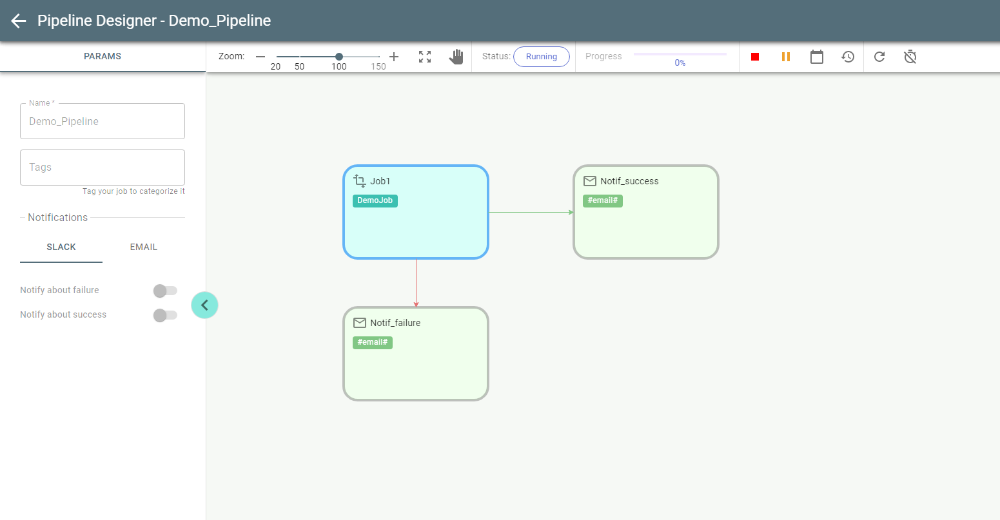
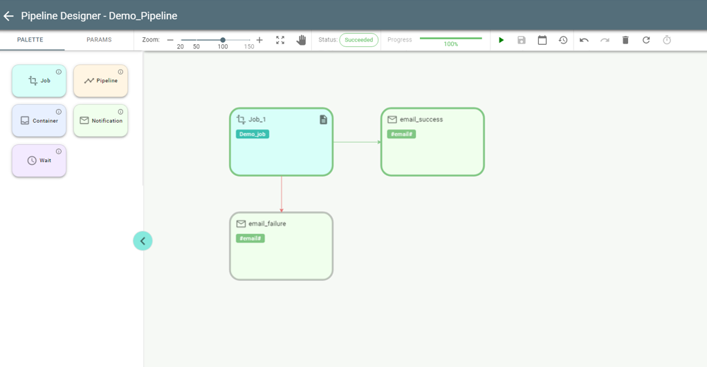

# Pipeline Execution

If you run a pipeline, as in the above example, its status changes from *Draft* to *Pending* and then to *Running*. 
Push Refresh to update the status.
The border of the stage currently running is painted in *Blue*:
While running a pipeline can be stopped or suspended with *Stop/Suspend* buttons respectively: 

Once suspended it can be resumed with Resume button:

If a pipeline succeeds, all completed stages are painted in *Green*, indicating success.
The stages configured for failure scenario (red arrow) remain *Gray* as a Draft as they have not been executed.

If a pipeline fails, then the *Red* border indicates the failed stage:

A failed pipeline can be re-run with  button from Pipelines overview page.

**Important**: *Job* stage has the *Logs* button  for analyzing logs of a certain job.
Use the *History* button  to view information about previous runs of the pipeline.
