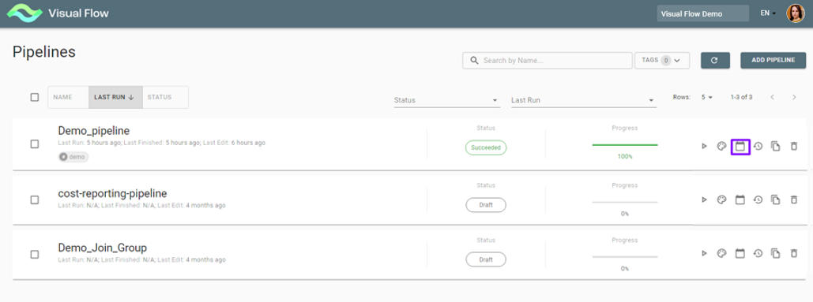
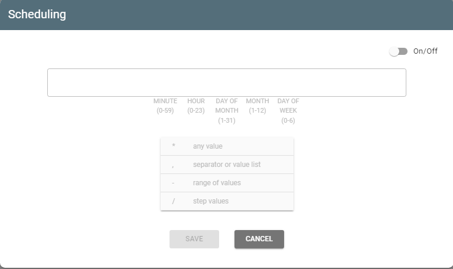
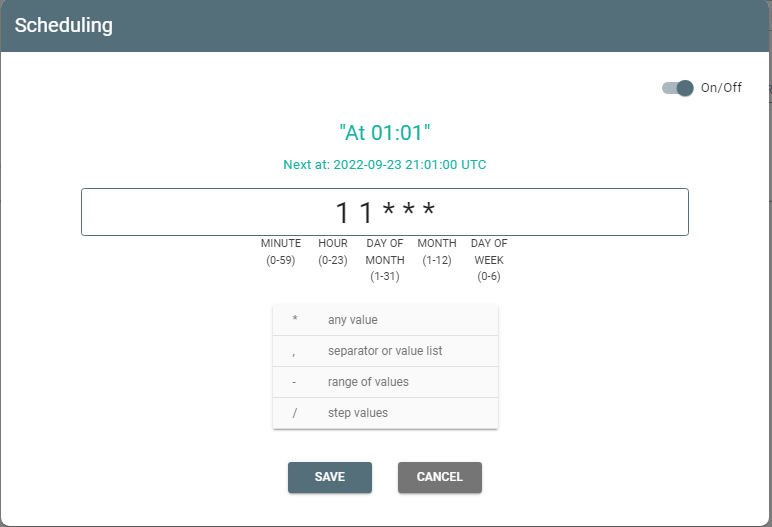

# Scheduling a pipeline.

You can schedule a pipeline to run with the *Scheduling* button:

It opens the Scheduling window:

Switch the toggle on and enter values of *minute/day/day* of *month/month/day* of the week through
spaces according to the tips:

