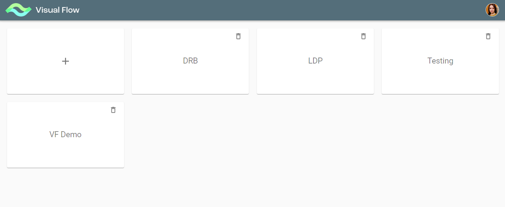
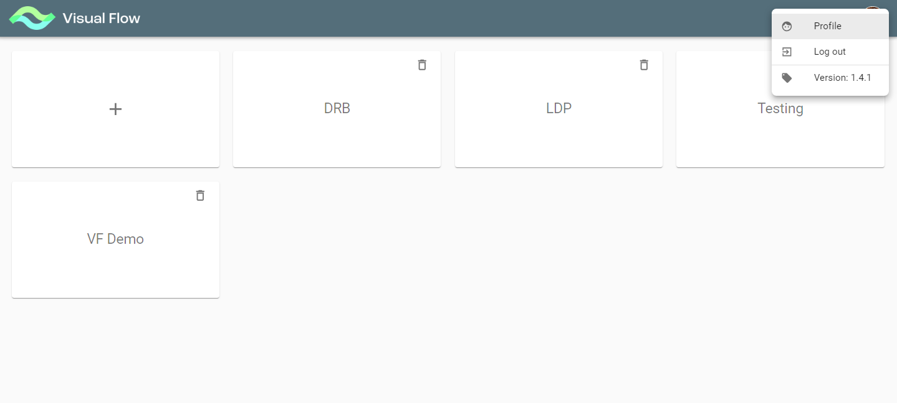

# Getting started

Once you first log on to the application, you see the initial screen with all existing projects:

If you are not authorized for a particular project, it is locked for you, so you see the lock icon on its tile.
Please contact project owners to get access to their projects.
If you click on the user icon in the top right corner, you get to user profile menu:

Here you can view your user profile or log out. Also it displays the application current version number.