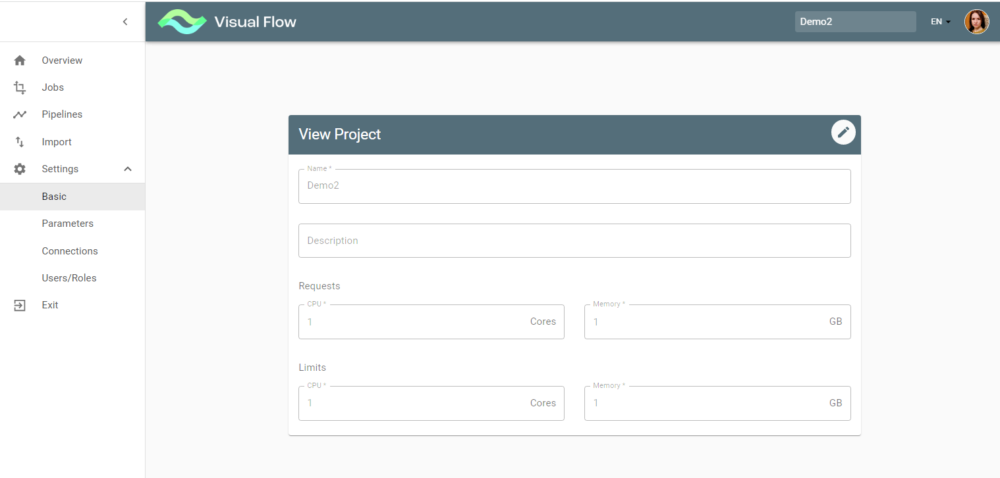
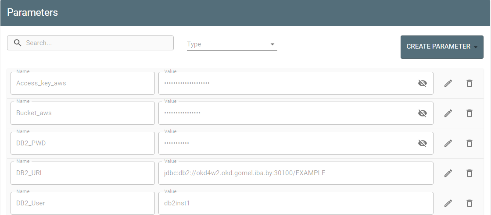
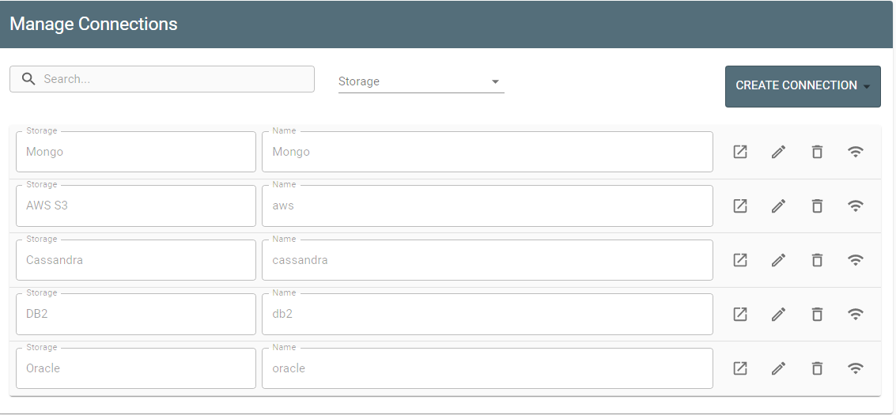

#Manage Project Settings

The Settings submenu contains:

* Basic
* Parameters
* Connections
* Users/Roles

1) The Basic is already there after project creation. The Edit button turns on the edit mode for updates.

2) The Parameters stores values required for the entire project, e.g., JDBC connection, DB2 credentials, or
table schema can be the same for multiple jobs within a project and therefore stored at the project level.
The Create Parameter button opens dialog on the right so you can introduce a new parameter.

3) The Connections option enables the user to manage connections to a storage.
Here you see a list of all existing connections with their name/storage type and available actions (view, edit,
delete, ping). Also, you can create a new connection with the Create Connection button.

4) The Users/Roles is meant for user access management or to view user access depending on your
authorization. Users cannot set roles to themselves. This operation can be performed by Admin or Super-
admin only. So if you try to change your role, you will get the error message: “You cannot change your role”.
The Edit button and therefore Edit mode is only available for an Admin within the project or for a Super-
admin.

